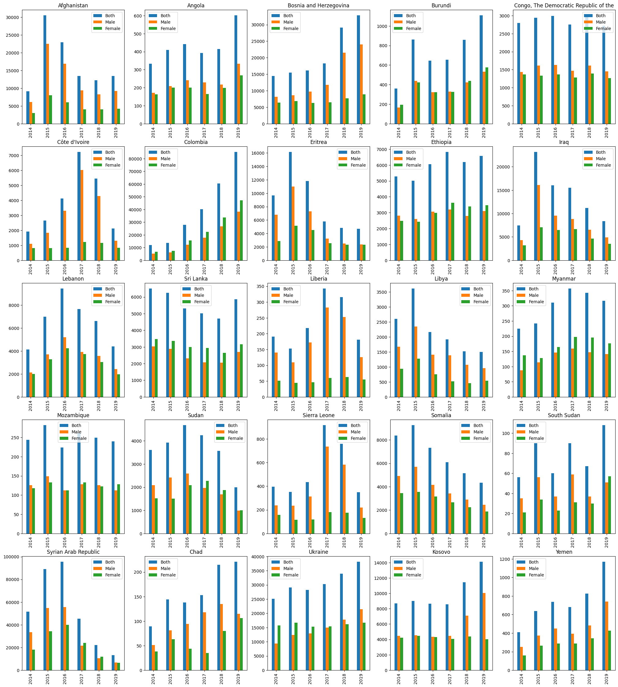
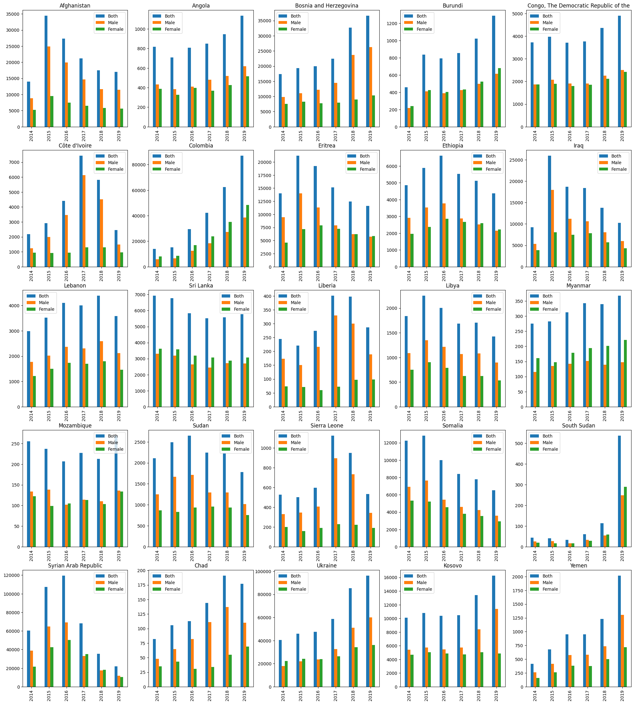
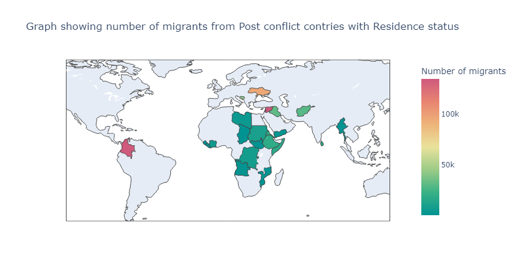
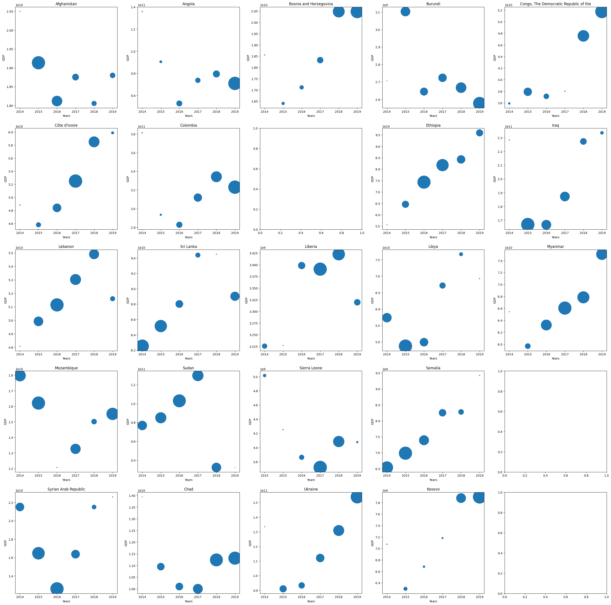
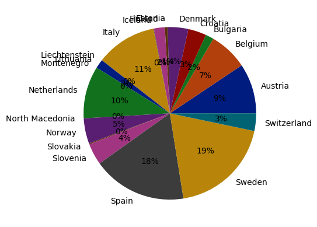
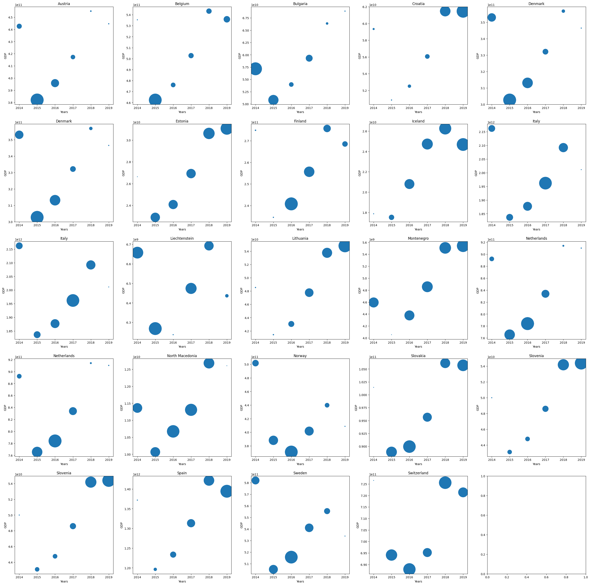

# Milestone 3: Data Analysis
**5-16 February, 2024**

## Non-Technical Explanation
In our analysis of selected countries over the five-year period (2014-2019), distinct migration patterns emerged from EuroStat's dataset. The data indicates that, in general, more men migrate than women. However, exceptions exist, such as in Sri Lanka, Myanmar, Sudan, Mozambique, Colombia, Ethiopia, and Madagascar, where women's migration rates surpass those of men. This underscores significant gender variations in migration patterns and specific trends in certain countries.

A simple internet search reveals that gender disparities in migration are influenced by factors like a preference for societies with gender equality, economic opportunities, and sociocultural elements. Women often migrate independently for better work and education, contributing to a balanced gender representation in migration flows.

Education and empowerment are crucial drivers for female migration, as women seek growth in societies offering these opportunities. Government policies promoting gender equality also shape migration patterns. A comprehensive understanding requires exploring specific data points, recognizing the complex interplay of economic, social, and political factors in migration dynamics.

Upon executing the code, the initial findings will revolve around two **Bar Graphs**:

1. Bar graph showing Male, Female and Both(Male and Female) ratio of the imigrants with residence status in the respective years w.r.t the origin country. The results are for ESTAT dataset.

2. Bar graph showing Male, Female and Both(Male and Female) ratio of the imigrants with citizenship status in the respective years w.r.t the origin country. The results are for ESTAT dataset.

Examining the migration data, patterns emerge, highlighting higher migration rates in specific years for certain countries. Further exploration into the reasons for this phenomenon provides valuable insights:

1. Afghanistan 2015: Increased migration due to persistent security concerns and ongoing conflicts.
2. Angola 2019: Escalating political instability and economic challenges fueled higher migration.
3. Bosnia and Herzegovina 2019: Rising migration linked to regional tensions and economic factors.
4. Burundi 2019: Heightened migration likely connected to political instability and social unrest.
5. Chechnya (part of the conflict in Russia): Ongoing regional conflicts identified as a primary driver of migration.
6. Colombia 2019: Migration surge influenced by a combination of political and economic challenges.
7. Democratic Republic of Congo 2019: Political instability and conflict prompting an increase in migration.
8. Eritrea 2015: Migration upsurge amid political repression and limited economic opportunities.
9. Ethiopia (various conflicts, including the Ethiopian Civil War) 2016: Escalating conflicts and civil unrest contributing to migration.
10. Iraq 2015: Increased migration due to conflicts, security concerns, and economic challenges.
11. Ivory Coast (Côte d'Ivoire) 2017: Economic factors and political stability influencing migration patterns.
12. Kosovo 2019: Migration rise linked to economic hardships and political tensions.
13. Lebanon 2016, 2017, 2018: Ongoing regional conflicts and economic instability driving migration.
14. Liberia 2017, 2018: Economic difficulties and recovery from past conflicts impacting migration.
15. Libya 2015: Escalating political instability and security concerns contributing to migration.
16. Mozambique 2019, 2014: Regional conflicts and economic challenges driving migration.
17. Myanmar 2017, 2018, 2019: Rohingya crisis and ethnic conflicts leading to increased migration.
18. Northern Ireland (The Troubles, though largely resolved by 2011): Lingering effects of past conflicts contributing to migration.
19. Sierra Leone 2017: Economic factors and recovery from past conflicts impacting migration.
20. Somalia 2014, 2015: Ongoing conflicts, political instability, and economic challenges fueling migration.
21. South Sudan 2019: Political instability, conflicts, and economic difficulties leading to migration.
22. Sri Lanka 2014, 2015: Post-war recovery and economic opportunities influencing migration.
23. Sudan 2015, 2016: Ongoing conflicts, economic challenges, and political instability driving migration.
24. Syria 2016: Escalating conflicts and humanitarian crisis contributing to migration.
25. Ukraine (conflict escalated in 2014) 2019: Ongoing conflict and political tensions leading to migration.
26. Yemen 2019: Prolonged conflicts and humanitarian crisis driving migration.

## Technical Overview

# Comprehensive Data Analysis Report

Our in-depth analysis harnessed EuroStat (ESTAT) and UN datasets, with a primary focus on the 2014-2019 period. The objective was to provide a comprehensive perspective, requiring the integration of GDP data from the World Bank. The meticulous selection of columns followed past recommendations, incorporating valuable insights from neighboring countries.

- Seperated DataFrame which shows total number of emigrants from the origin countries who left their countries to seek residence in 6 years(2014-2019)

## Investigative Focus

The core of our investigation centered on unraveling migration patterns within post-conflict regions. Our primary goal was to identify key influencers driving migration, guiding individuals from their origin countries to new destinations. Initial exploration uncovered various migration datasets, but none precisely matched our specific focus on post-conflict scenarios.
In the second phase of data cleaning, our attention shifted to factors contributing to our anticipated patterns. To address concerns arising from the temporal gap between 2019 and 2024, we directed our focus to countries embroiled in conflict from 2014 to 2019. This approach, while excluding certain nations, enabled us to predict migration patterns bridging both past and current conflicts.

- Seperated DataFrame which shows total number of emigrants from the origin countries who left their countries to seek citizenship in 6 years(2014-2019)

| origin_name                             | origin_alpha_3 | citizen_sum_5_years |
|-----------------------------------------|----------------|----------------------|
| Afghanistan                             | AFG            | 37865.0              |
| Angola                                  | AGO            | 1977.0               |
| Bosnia and Herzegovina                 | BIH            | 48685.0              |
| Burundi                                 | BDI            | 2591.0               |
| Chad                                    | TCD            | 288.0                |
| Colombia                                | COL            | 138902.0             |
| Congo, The Democratic Republic of the   | COD            | 11058.0              |
| Côte d'Ivoire                           | CIV            | 6067.0               |
| Eritrea                                 | ERI            | 34732.0              |
| Ethiopia                                | ETH            | 15296.0              |
| Iraq                                    | IRQ            | 34737.0              |
| Kosovo                                  | XK             | 28072.0              |
| Lebanon                                 | LBN            | 10281.0              |
| Liberia                                 | LBR            | 426.0                |
| Libya                                   | LBY            | 3845.0               |
| Mozambique                              | MOZ            | 657.0                |
| Myanmar                                 | MMR            | 1024.0               |
| Sierra Leone                            | SLE            | 1131.0               |
| Somalia                                 | SOM            | 24028.0              |
| South Sudan                             | SSD            | 399.0                |
| Sri Lanka                               | LKA            | 18927.0              |
| Sudan                                   | SDN            | 6137.0               |
| Syrian Arab Republic                    | SYR            | 169453.0             |
| Ukraine                                 | UKR            | 98747.0              |
| Yemen                                   | YEM            | 2086.0               |

## Introduction of GDP Variable

During the subsequent data analysis phase, we introduced a new variable – GDP. Exploring theories linking destination countries' perceptions of economic issues in origin countries to migration, our findings revealed an absence of a consistent correlation between GDP and the number of migrants from conflict-afflicted origin countries.

While some origin countries exhibited a correlation between GDP and migration, others did not. Recognizing the intricate nature of migration determinants, we delved into additional factors influencing migration in the non-technical section of our project.

- Relation between origin countries GDP and number of migrants over the period of 6 years (2014-2019)
  
  

## Analysis of Popular Destination Countries

We opted to explore a comprehensive list of European countries as potential destinations for emigrants, focusing on those displaying greater receptivity and hosting more immigrants over the past six years.

- Relation between origin countries GDP and number of migrants over the period of 6 years (2014-2019)
  
  
  
- Favourite destination countries of migrants from conflicted countries.
This dataset provides information on migration between various countries, including the total number of people who have migrated over a six-year period and the geodesic distance between the origin and destination countries.
  
| origin_name                           | destination_name        | Total_6_years | geodesic_distance_km |
|---------------------------------------|-------------------------|---------------|----------------------|
| Afghanistan                           | Austria                 | 67306.0       | 4636.538275          |
| Angola                                | Belgium                 | 3020.0        | 6958.978978          |
| Bosnia and Herzegovina                | Slovenia                | 91670.0       | 326.198961           |
| Burundi                               | Belgium                 | 5982.0        | 6446.514154          |
| Chad                                  | Italy                   | 537.0         | 2987.462572          |
| Colombia                              | Spain                   | 439322.0      | 8040.015722          |
| Congo, The Democratic Republic of the | Belgium                 | 25294.0       | 6266.452572          |
| Côte d'Ivoire                         | Italy                   | 39650.0       | 4201.838103          |
| Eritrea                               | Sweden                  | 52826.0       | 5276.632409          |
| Ethiopia                              | Netherlands             | 21872.0       | 5733.854601          |
| Iraq                                  | Sweden                  | 52646.0       | 3504.952911          |
| Kosovo                                | Switzerland             | 28497.0       | 1106.580352          |
| Lebanon                               | Sweden                  | 15721.0       | 3178.687652          |
| Liberia                               | Italy                   | 1544.0        | 4488.389237          |
| Libya                                 | Italy                   | 7288.0        | 1775.533107          |
| Mozambique                            | Italy                   | 750.0         | 7107.044344          |
| Myanmar                               | Switzerland             | 930.0         | 8097.416659          |
| Sierra Leone                          | Italy                   | 3458.0        | 4407.133209          |
| Somalia                               | Sweden                  | 32551.0       | 6529.316611          |
| South Sudan                           | Norway                  | 425.0         | 6004.901735          |
| Sri Lanka                             | Italy                   | 51107.0       | 7628.194384          |
| Sudan                                 | Sweden                  | 12340.0       | 5331.470293          |
| Syrian Arab Republic                  | Sweden                  | 270812.0      | 3176.818517          |
| Ukraine                               | Italy                   | 101160.0      | 1626.414541          |
| Yemen                                 | Sweden                  | 3636.0        | 5506.369092          |

Expanding our inquiry to popular destination countries (Sweden, Spain, Italy), a parallel correlation between the number of migrants and GDP emerged. However, similar to the origin countries, this correlation proved in consistent across all destination countries. In conclusion, a definitive statement regarding whether the GDP of our origin or destination countries directly affects the number of migrants remains elusive.

- Relation between destination countries GDP and number of migrants over the period of 6 years (2014-2019)
  
  

- This comprehensive table presents crucial migration data points that facilitate in-depth analysis of migration patterns and trends between diverse countries. The included metrics, such as the total number of migrants over a six-year period, along with the UN-estimated net migration rates, offer valuable insights into the dynamics of population movement.

| origin_name                        | destination_name     | Total_6_years | UN_destination_net_migr_rate_2015-2020  | UN_origin_net_migr_rate_2015-2020 |
|------------------------------------|----------------------|---------------|-----------------------------------------|-------------------------------------|
| Afghanistan                        | Austria              | 67306.0       | 7.351                                   | -1.716                              |
| Angola                             | Belgium              | 3020.0        | 4.196                                   | 0.211                               |
| Bosnia and Herzegovina             | Slovenia             | 91670.0       | 0.964                                   | -6.434                              |
| Burundi                            | Belgium              | 5982.0        | 4.196                                   | 0.181                               |
| Chad                               | Italy                | 537.0         | 2.461                                   | 0.131                               |
| Colombia                           | Spain                | 439322.0      | 0.856                                   | 4.162                               |
| Congo, The Democratic Republic of  | Belgium              | 25294.0       | 4.196                                   | NaN                                 |
| Côte d'Ivoire                      | Italy                | 39650.0       | 2.461                                   | -0.323                              |
| Eritrea                            | Sweden               | 52826.0       | 4.027                                   | -11.571                             |
| Ethiopia                           | Netherlands          | 21872.0       | 0.939                                   | 0.278                               |
| Iraq                               | Sweden               | 52646.0       | 4.027                                   | 0.207                               |
| Kosovo                             | Switzerland          | 28497.0       | 6.135                                   | NaN                                 |
| Lebanon                            | Sweden               | 15721.0       | 4.027                                   | -4.493                              |
| Liberia                            | Italy                | 1544.0        | 2.461                                   | -1.049                              |
| Libya                              | Italy                | 7288.0        | 2.461                                   | -0.301                              |
| Mozambique                         | Italy                | 750.0         | 2.461                                   | -0.172                              |
| Myanmar                            | Switzerland          | 930.0         | 6.135                                   | -3.050                              |
| Sierra Leone                       | Italy                | 3458.0        | 2.461                                   | -0.554                              |
| Somalia                            | Sweden               | 32551.0       | 4.027                                   | -2.694                              |
| South Sudan                        | Norway               | 425.0         | 5.273                                   | -15.902                             |
| Sri Lanka                          | Italy                | 51107.0       | 2.461                                   | -4.631                              |
| Sudan                              | Sweden               | 12340.0       | 4.027                                   | -1.208                              |
| Syrian Arab Republic               | Sweden               | 270812.0      | 4.027                                   | -24.080                             |
| Ukraine                            | Italy                | 101160.0      | 2.461                                   | 0.226                               |
| Yemen                              | Sweden               | 3636.0        | 4.027                                   | -1.065                              |

- In our concluding graph, we will present the outcomes derived from the compilation of countries and their respective destination countries, showcasing the net migration rate. This metric encapsulates the intricate balance between immigration and emigration, providing a comprehensive overview of population dynamics in these interconnected regions.

  - Our final graph holds a pivotal role in unraveling the intricacies of global population movements. It specifically highlights the net migration rate, a metric that goes beyond mere immigration and emigration numbers. The net migration rate provides a nuanced understanding of the demographic equilibrium within these regions.

  - This metric is a powerful indicator of the net population change resulting from migration, taking into account both the influx and outflow of individuals. A positive net migration rate signals a net gain in population for the destination country, suggesting higher levels of immigration compared to emigration. Conversely, a negative net migration rate indicates a net loss, where more people are leaving than arriving.

  - By incorporating the net migration rate into our analysis, we gain valuable insights into the socio-economic dynamics of these interconnected regions. It serves as a compass for assessing the attractiveness of a destination country, the impact on its workforce, and potential economic implications.

  - Furthermore, the net migration rate is a key consideration for policymakers and researchers. It offers a lens through which to evaluate the success and sustainability of immigration policies, helping governments make informed decisions about resource allocation, infrastructure planning, and societal integration.

  - In essence, the net migration rate is not just a numerical representation; it is a crucial tool for deciphering the complex interplay of factors that shape the population landscapes of countries. Our graph, showcasing this vital metric, provides a comprehensive narrative of how migration influences the demographic tapestry, offering valuable insights for strategic planning, policy formulation, and a deeper understanding of global interconnectedness.

https://github.com/MIT-Emerging-Talent/2024-group-07-cdsp/issues/60#issue-2164315105
  

